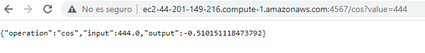
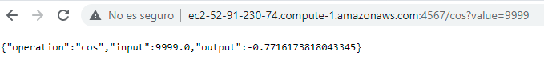
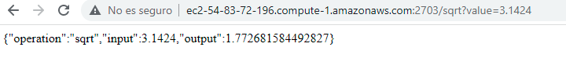

# Parcial 2

Se desarrollan dos servidores, un servidor proxy que hara las veces de 
balanceador de carga, se encargará de recibir todos los llamados
y enviará la petición a uno de los otros dos servidores. El segundo será
un servidor de operaciones matemáticas, este expondrá dos
servicios _**/cos**_ y **_/sqrt_**. Del servidor de operaciones matemáticas,
se generan dos instancias. 

## Servidor de operaciones matemáticas 1

## Servidor de operaciones matemáticas 2

## Servidor proxy

Dentro del repositorio, se encuentra un vídeo que detalla mejor el funcionamiento
del los servidores. 

## Correr de manera local.

### Requerimientos
- mvn 
- java
- git

Para correr de manera local se deberá

- Clonar el repositorio

`git clone https://github.com/laura-gar/Parcial-2.git`

- Realizar la instalación de paquetes mvn 

`mvn clean install`

- Correr App.java y ProxyServer.java

## Correr en AWS 

- Generar una instancia de EC2

- Entrar a la instacia usando ssh
  
- Dentro de la instancia instalar git para poder clonar el repositorio
`sudo yum install git -y`
- Clonar el repositorio `git clone https://github.com/laura-gar/Parcial-2.git`
- Instalar java `sudo yum install java-1.8.0`
- Correr la clase de Java que se quiera `java -cp "target/classes:target/dependency/*""edu.escuelaing.arep.App"`

